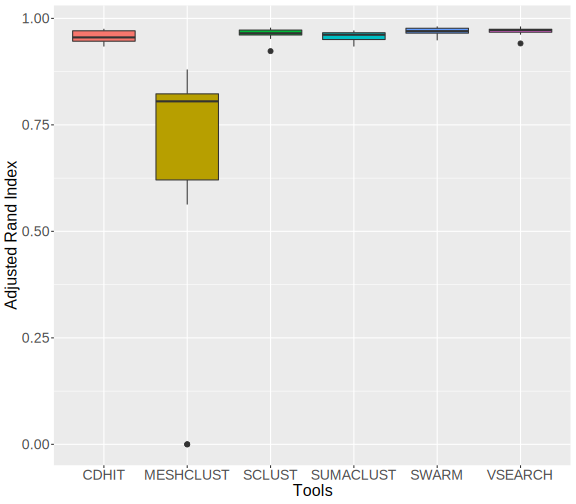
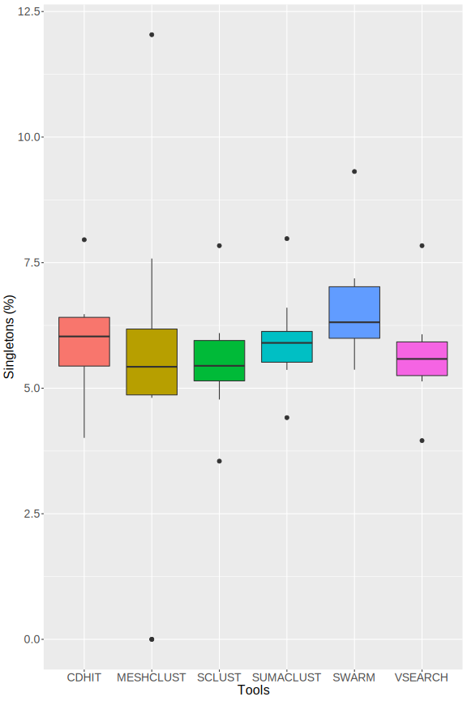
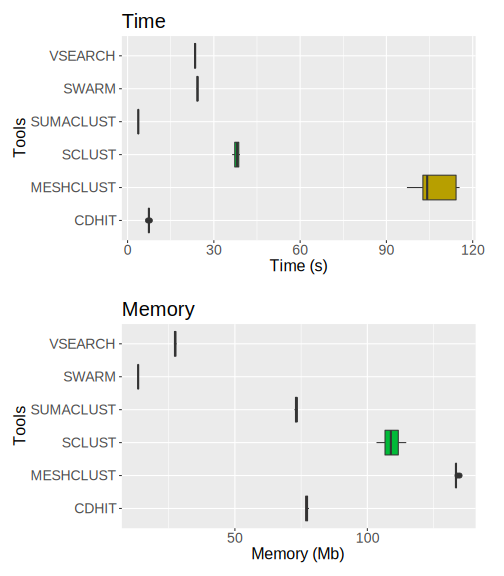

# Comparison of 16S amplicons clustering tools

## Material and methods 

### Data used for evaluation 

To test Sclust, data for FROGS's evaluation are used (http://frogs.toulouse.inra.fr/). Synthethic data with powerlaw distribution and 1000 strains are used (http://frogs.toulouse.inra.fr/data_to_test_frogs/assessment_datasets/datasets_silva/1000sp/dataset_1/V4V4/powerlaw/). It's 16S sequencing sequencing simulation (V4 region). Powerlaw distribution is more realistic with few strain with high abundance and other strains with low abundance. Dataset_1 is selected arbitrarily. Dataset contains 10 samples with same strains but different abundance levels. (for example in sample 1 you will have strain1 in very high abundance and strain2 in low abundance and it will be the opposite in sample 2.). 20 most abundant strains with reads count for each sample is given in [Supplementary Figure 1]()

Sequencing simulation from FROGS contains chimeras reads, identified by the presence of two reference in fastq header. This chimera reads are removed with homemade script `exclude_chimeras.py`. 
Then, reads are deduplicated with `vsearch`.  
Taxonomy is treated with homemade script `frogs_taxo.py` which allows to better presentation of taxonomy present in fastq header.

Preprocessing stats are in [Supplementary Table 1](clusteringEval_RESULTS/tools_comparison/all_samples-1000sp-Powerlaw.preprocessing_stats.tsv)

### Clustering 

#### Define best parameters for SCLUST

Sclust is launch for each sample (1 to 10), with id from 95 to 99 (steps of 1), weak id 2 below id (for example 97 for id 99 and 95 for id 97), and quality from 0 to 1 with steps of 0.25. 
2 modes are tested : default mode, and accurate mode (much slower) with --maxrejects 0 and --maxaccepts 0 leading to comparisons with all database instead of just selected centroids. 
Script `clusteringEval_testSclust.sh` allows to launch all clustering and evaluation for one sample. 

#### Compare SCLUST with other tools 

SCLUST is compared with 5 others clustering tools : CD-HIT, SWARM, VSEARCH, MESHCLUST and SUMACLUST. 
CD-HIT, VSEARCH and MESHCLUST are launched with threshold id of 97%. SCLUST is launched with id of 97, weak id of 95 and quality of 0, parameters determined as best (see Results section). SWARM is launched with default parameters (d=1) as advised in its publication. Tools are launched for the 10 samples. 
Homemade script `clusteringEval_clustering.sh` launchs all clusterings with one fasta file in input and `clusteringEval_eval.sh` launchs evaluation parameters calculation for clusterings.

### Evaluation 

Evaluation is made according to 5 criterias :
* Precision : represents the ability of tool to reconstruct clusters with only 1 strain inside (avoid over-grouping) 
* Recall : represents the ability of tool to reconstruct clusters with all reads from 1 strain (avoid over-splitting) 
* ARI (Adjusted Rand Index) : summarize precision and recall, by taking acount the random chance to group 2 reads from same strains in same cluster. 
Swarm paper definition : *"adjusted Rand index, which summarizes both precision and recall as the proportion of pairs of amplicons that are placed in the same OTU and are from the same species, but adjusting for the expected proportions through random chance"* 
* Singletons percentage : represents the rate of singletons clusters among all clusters. 
* Time and Memory : Time is user time to compute clustering and memory max memory used. 

Precision, recall and ARI definitions and computation are the same used in vsearch and swarm paper. 

## Results  

#### SCLUST test 

#### SCLUST vs other tools 

Recall and precision are in [Supplementary Figure 2](clusteringEval_RESULTS/tools_comparison/precision_recall.svg)

 

|Tool| Mean total clusters | Mean clusters size > 1 | Mean clusters size > 0.05% of reads | 
|------|--------------|-----------------|------------|
| CD-HIT | 725.9 |  682.8 | 255.9 |
| MESHCLUST | 508.5 | 472.3 | 196.2 |
| SCLUST | 736.7 | 695.9 | 263.9 |
| SUMACLUST | 749.9 | 704.8 | 257.6 |
| SWARM | 1293.9 | 731.6 | 257.7 |
| VSEARCH | 736.7 | 695 | 262.2 |

Figures of number clusters distribution are in [Supplementary Figure 3](clusteringEval_RESULTS/tools_comparison/number_clusters.svg) 

