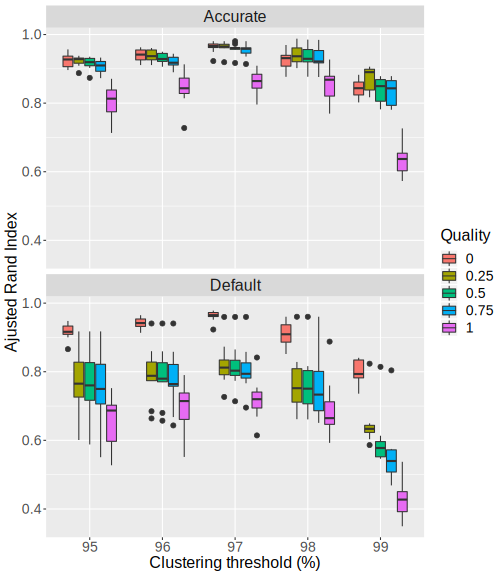
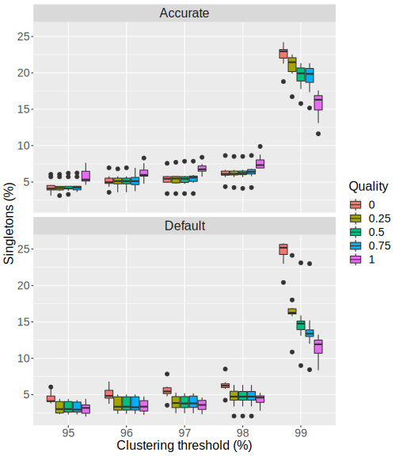
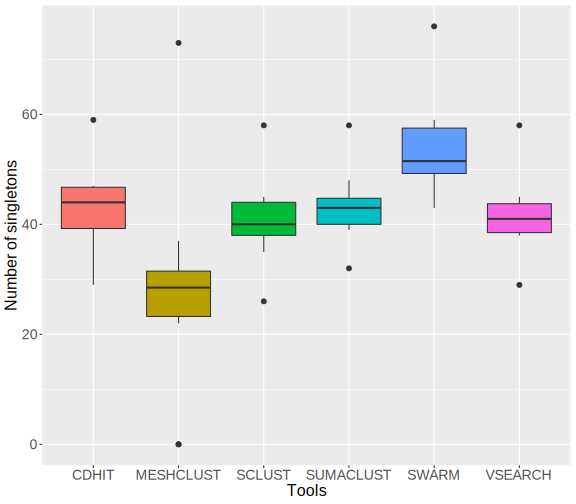
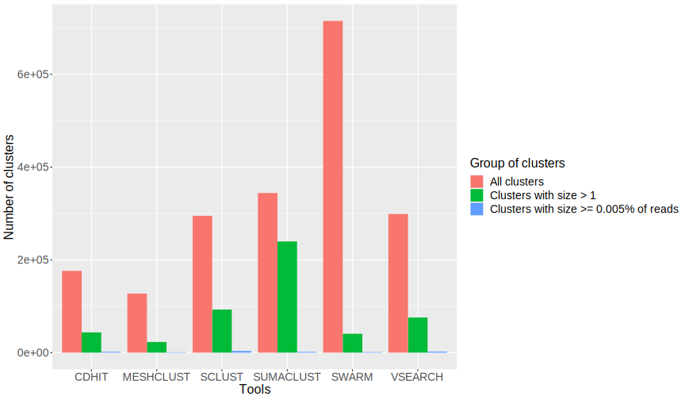
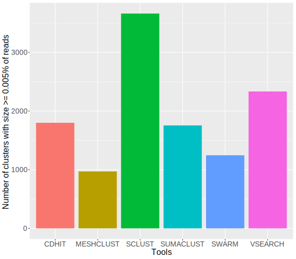

# Comparison of 16S amplicons clustering tools

## Material and methods

### Data used for evaluation 

#### Synthetic data

To test SCLUST, data for FROGS's evaluation are used (http://frogs.toulouse.inra.fr/). Synthethic data with powerlaw distribution and 1000 strains are used (http://frogs.toulouse.inra.fr/data_to_test_frogs/assessment_datasets/datasets_silva/1000sp/dataset_1/V4V4/powerlaw/). It's 16S sequencing sequencing simulation (V4 region). Powerlaw distribution is more realistic with few strain with high abundance and other strains with low abundance. Dataset_1 is selected arbitrarily. Dataset contains 10 samples with same strains but different abundance levels. (for example in sample 1 you will have strain1 in very high abundance and strain2 in low abundance and it will be the opposite in sample 2.). 20 most abundant strains with reads count for each sample is given in [Supplementary Figures 1](clusteringEval_RESULTS/abundance_samples.pdf)

Sequencing simulation from FROGS contains chimeras reads, identified by the presence of two reference in fastq header. This chimera reads are removed with homemade script `exclude_chimeras.py`. 
Then, reads are deduplicated with `vsearch`.  
Taxonomy is treated with homemade script `frogs_taxo.py` which allows to better presentation of taxonomy present in fastq header.

#### Real sequencing data 

Real sequencing data used to test SCLUST are microeukaryotic 16S RNA pyrosequencing data from 31 freshwater sites, mostly lakes. ([Debroas 2017](https://www.ncbi.nlm.nih.gov/pubmed/28334157)). Reads count for each sites are provided in [FW_newname_30_06_2015.counts](clusteringEval_RESULTS/FW_newname_30_06_2015.counts) All lakes are pooled together in one sample. Reads are already cleaned. This cleaned reads are deduplicated with `vsearch --derep_full_length`.  

### Clustering 

#### Define best parameters for SCLUST

Sclust is launch for each sample (1 to 10), with id from 95 to 99 (steps of 1), weak id 2 below id (for example 97 for id 99 and 95 for id 97), and quality from 0 to 1 with steps of 0.25. 
2 modes are tested : default mode, and accurate mode (much slower) with --maxrejects 0 and --maxaccepts 0 leading to comparisons with all database instead of just selected centroids. 
Script `clusteringEval_testSclust.sh` allows to launch all clustering and evaluation for one sample.  

#### Compare SCLUST with other tools with synthetic data 

SCLUST is compared with 5 others clustering tools : CD-HIT, SWARM, VSEARCH, MESHCLUST and SUMACLUST. This tools are launched on synthetic data from FROGS. 
CD-HIT, VSEARCH and MESHCLUST are launched with threshold id of 97%. SCLUST is launched with id of 97, weak id of 95 and quality of 0, parameters determined as best (see Results section). SWARM is launched with distance parameter d = 3. All clusterings are launched following each other for each sample on hpc2 mesocentre.   

#### Compare SCLUST with other tools with real sequencing data 

Lake data are clustered with the 6 clustering tools : CD-HIT, SCLUST, SWARM, VSEARCH, MESHCLUST and SUMACLUST. Clustering is launched for each tool on hpc2 mesocentre. Parameters are the same as for synthetic data : CLUST is launched with id of 97, weak id of 95 and quality of 0, parameters determined as best (see Results section). SWARM is launched with distance parameter d = 3.
CD-HIT, SWARM, VSEARCH, MESHCLUST and SUMACLUST has been launched on hpc2 with 32 threads. 
For SCLUST, there's an memory limit error with 32 threads on normal node (even for nodes with 250Gb RAM) and smp node. It works with 16 threads on smp node.  

### Evaluation 

#### On synthetic data clustering 

All evaluation is compute by homemade script `clusteringEval_eval.sh` 
Evaluation is made according to 5 criterias :
* Precision : represents the ability of tool to reconstruct clusters with only 1 strain inside (avoid over-grouping) 
* Recall : represents the ability of tool to reconstruct clusters with all reads from 1 strain (avoid over-splitting) 
* ARI (Adjusted Rand Index) : summarize precision and recall, by taking acount the random chance to group 2 reads from same strains in same cluster. 
Swarm paper definition : *"adjusted Rand index, which summarizes both precision and recall as the proportion of pairs of amplicons that are placed in the same OTU and are from the same species, but adjusting for the expected proportions through random chance"* 
* Clusters count 
	* Total clusters : number of all clusters created by tools. 
	* Singletons percentage : number of singletons clusters among all clusters
	* Clusters with size > 1 : number of clusters after discard singletons. 
	* Clusters with size >= 0.05% of reads : number of clusters containing at least 0.05% of all reads.  
* Time and Memory : Time is user time to compute clustering and memory max memory used. 
* Distance : Distance is some kind of taxonomic distance computed. For a pair of reads with known taxonomy, it's defined as length between closest common taxon in the tree and strain level. Distance will be 0 for same specie, 1 for same genus, 2 for same family and so on. 7 classical taxonomic ranks are considered : `Kingdom;Phylum;Class;Order;Family;Genus;Specie`. For each cluster, mean and max intra cluster distance are computed. Mean distance is the mean distance between all pairs of reads. Max distance is the highest pair distance in cluster. For one sample, global distance is the mean of all intra-clusters distance.  

Precision, recall and ARI definitions and computation are the same used in vsearch and swarm paper. 

#### On real sequencing data clustering 

On real sequencing data, we don't have taxonomy of reads so it's no possible to evaluate recall, precision, ARI or distance parameters. 
We looked at clusters count, with total clusters, singletons and clusters with size >= 0.005% of reads (185 for lake data). Memory is alse reported. 

## Results  

### Preprocessing 

Preprocessing stats for FROGS synthetic data are in [Supplementary Table 1](clusteringEval_RESULTS/all_samples-1000sp-Powerlaw.preprocessing_stats.tsv). 
For real sequencing lake data, we have 6 777 514 sequences before dereplication and 3 718 186 after. 

### SCLUST test 

[Raw data]()

**Figure 1** : Distribution of Adjusted Random Index for each SCLUST parameters. Adjusted Rand Index is calculated as presented [here](https://en.wikipedia.org/wiki/Rand_index#Adjusted_Rand_index)  

**Figure 2** : Distribution of singletons percentage in created clusters for each SCLUST parameters. 

Recall and precision are given in [Supplementary Figure 2](clusteringEval_RESULTS/test_SCLUST/recall_precision_boxplot.svg)

Detailed values for all samples and parameters are given in [Supplementary Table 2](clusteringEval_RESULTS/test_SCLUST/all_samples-1000sp-Powerlaw.noChimeras.derep.eval.tsv)

Figures with all samples separated are given in [Supplementary Figure 3 (ARI)](clusteringEval_RESULTS/test_SCLUST/ari_all.svg), [Supplementary Figure 4 (Recall/Precision)](clusteringEval_RESULTS/test_SCLUST/recall_precision_all.svg) and [Supplementary Figure 5 (Singletons)](clusteringEval_RESULTS/test_SCLUST/singletons_all.svg)

* Sclust performs better with 97% threshold, in accurate or default mode. It's the threshold with less variability and with best ARI values, for each quality parameters.
* Sclust is sensible to inputs. Results shows variability, mostly in default mode with quality over 0. 
* In default mode, quality 0 leads always to better ARI. With quality 0, results looks alike for default or accurate mode. For other qualities, pattern changes with less high ARI and more variability. 
* Singletons percentage rises for 99% threshold (median of 23%), which is an expected pattern. More the threshold is high, more the clusters will be split. However, singletons percentage very slightly increases from 95 to 97 % threshold (median 4% to 5% for quality 0) 
* Accurate mode increases execution time. In accurate mode, time is multiplied from 20 for threshold 95% to 32 for threshold 99%. 

**Conclusion** : We can't keep accurate mode due to computation time. It will not be scalable with more reads. For quality 0, clusters quality is almost the same with default and accurate mode, so we choose to keep default mode with quality 0 and threshold 97 for evaluation against other tools. 

### SCLUST vs other tools (synthetic data) 

Raw data : 
* [All clusters](clusteringEval_RESULTS/tools_comparison/all_samples-1000sp-Powerlaw.noChimeras.derep.eval.tsv)
* [Clusters with size > 1](clusteringEval_RESULTS/tools_comparison/all_samples-1000sp-Powerlaw.noChimeras.derep.nosingle.eval.tsv)
* [Clusters with size >= 0.05% of reads](clusteringEval_RESULTS/tools_comparison/all_samples-1000sp-Powerlaw.noChimeras.derep.005reads.eval.tsv)

**Figure 3** : Distribution of Adjusted Random Index for each tools. Threshold identity is 97% (and d=3 for SWARM). 

**Figure 4** : Distribution of singletons number for each tools. Threshold identity is 97% (and d=3 for SWARM) 

**Figure 5** : Distribution of time and max memory usage for clustering computation for each tool. 

Others graphs : 
* [Recall and precision](clusteringEval_RESULTS/tools_comparison/precision_recall.svg)
* [Number clusters](clusteringEval_RESULTS/tools_comparison/number_clusters.svg)
* [Singletons percentage](clusteringEval_RESULTS/tools_comparison/singletons_boxplot.svg)
* [Distance](clusteringEval_RESULTS/tools_comparison/distance_boxplot.svg) 

* MeshClust has lower ARI than other tools (median 0.82). Swarm has the best ARI (median 0.99). Sclust has ARI slightly lower than Vsearch (median 0.96 for sclust and median 0.97 for vsearch). 
* If we discard MeshClust wich produce bad clusters, sclust produces the least singletons (40.8 in mean, vs 41.7 for vsearch or 54 for swarm) and singletons is something we want to avoid. 
* Sclust is also tool with highest number of clusters with size >= 0.05% of reads, so it creates clusters with more sequences, and this clusters are almost as "correct" as vsearch. 
* MeshClust similarity calculation with learning doesn't work good in this dataset. When we used just alignment (option --align), evaluation parameters are better and similar to other tools (for sample01 at id 97, ARI is 0.75 with default mode and 0.95 with align mode), but this option requires a lot of calculation time.
* Sclust execution time is longer than vsearch (increase of 38.11% in mean) but slower than Meshclust. 

Then, parameters have been evaluated on 2 sub-selections of clusters : clusters with size > 1 and clusters with size >= 0.05%. For all tools, recall increases when small clusters are eliminated and precision decreases. The balance leads to ARI similary among selections. Taxonomic distances also increases. Increases and decreases are similar among tools, we don't have a tool "bad" with all clusters and "good" when we take only big clusters.  
  
Graphical representations : [Number of clusters](clusteringEval_RESULTS/tools_comparison/number_clusters_selected_clusters_boxplot.svg),[ARI](clusteringEval_RESULTS/tools_comparison/ari_selected_clusters_boxplot.svg),[Recall](clusteringEval_RESULTS/tools_comparison/recall_selected_clusters_boxplot.svg),[Precision](clusteringEval_RESULTS/tools_comparison/precision_selected_clusters_boxplot.svg),[Distance](clusteringEval_RESULTS/tools_comparison/distance_selected_clusters_boxplot.svg)

### SCLUST vs other tools (real sequencing data) 

[Raw data](clusteringEval_RESULTS/lake_data/FW_newname_30_06_2015.derep.eval.tsv)

**Figure 6** : Number of clusters with singletons 

**Figure 7** : Number of clusters with size >= 0.005% of reads

**Figure 8** : Max memory used 

Others graphs : [Singletons percentage](clusteringEval_RESULTS/lake_data/percent_singletons.svg)

### References 
* Debroas, D., Domaizon, I., Humbert, J. F., Jardillier, L., Lepère, C., Oudart, A., & Taïb, N. (2017). **Overview of freshwater microbial eukaryotes diversity: a first analysis of publicly available metabarcoding data.** FEMS microbiology ecology, 93(4), fix023
* Escudié, F., Auer, L., Bernard, M., Mariadassou, M., Cauquil, L., Vidal, K., ... & Pascal, G. (2017). **FROGS: find, rapidly, OTUs with galaxy solution.** Bioinformatics, 34(8), 1287-1294.
* James, B. T., Luczak, B. B., & Girgis, H. Z. (2018). **MeShClust: an intelligent tool for clustering DNA sequences.** Nucleic acids research.
* Li, W., & Godzik, A. (2006). **Cd-hit: a fast program for clustering and comparing large sets of protein or nucleotide sequences.** Bioinformatics, 22(13), 1658-1659.  
* Mahé, F., Rognes, T., Quince, C., de Vargas, C., & Dunthorn, M. (2014). **Swarm: robust and fast clustering method for amplicon-based studies.** PeerJ, 2, e593.  
* Rognes, T., Flouri, T., Nichols, B., Quince, C., & Mahé, F. (2016). **VSEARCH: a versatile open source tool for metagenomics.** PeerJ, 4, e2584.  
* Zou, Q., Lin, G., Jiang, X., Liu, X., & Zeng, X. (2018). **Sequence clustering in bioinformatics: an empirical study**. Briefings in bioinformatics. 
