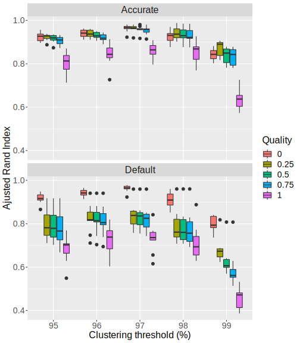
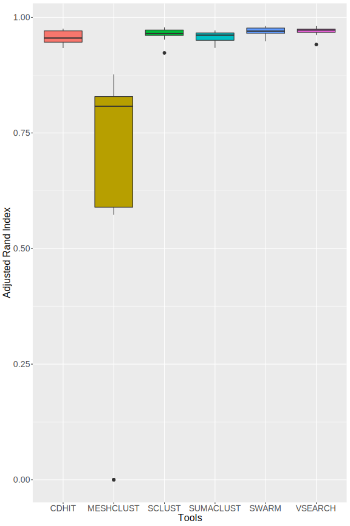
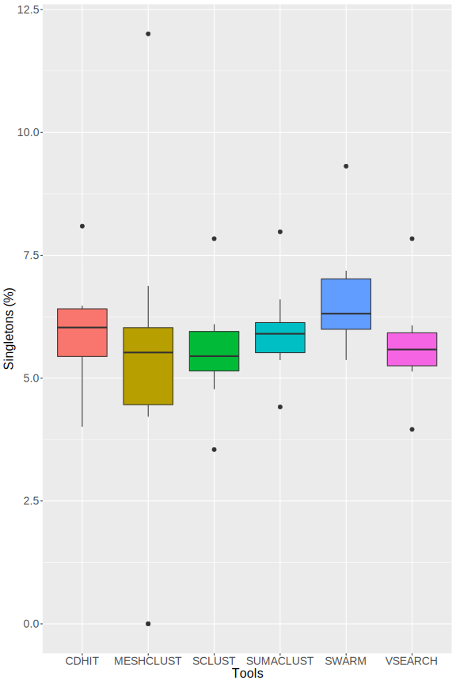
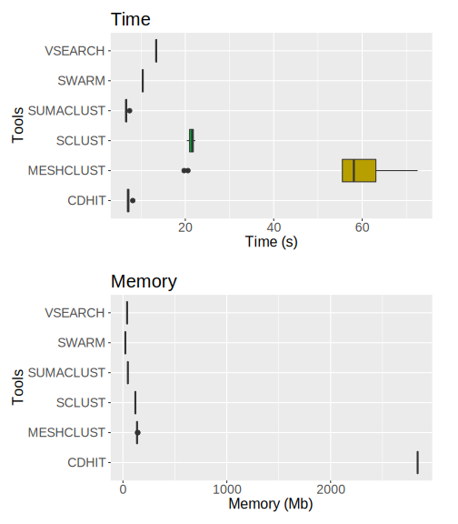

# Comparison of 16S amplicons clustering tools

## Material and methods

### Data used for evaluation 

To test SCLUST, data for FROGS's evaluation are used (http://frogs.toulouse.inra.fr/). Synthethic data with powerlaw distribution and 1000 strains are used (http://frogs.toulouse.inra.fr/data_to_test_frogs/assessment_datasets/datasets_silva/1000sp/dataset_1/V4V4/powerlaw/). It's 16S sequencing sequencing simulation (V4 region). Powerlaw distribution is more realistic with few strain with high abundance and other strains with low abundance. Dataset_1 is selected arbitrarily. Dataset contains 10 samples with same strains but different abundance levels. (for example in sample 1 you will have strain1 in very high abundance and strain2 in low abundance and it will be the opposite in sample 2.). 20 most abundant strains with reads count for each sample is given in [Supplementary Figures 1](clusteringEval_RESULTS/abundance_samples.pdf)

Sequencing simulation from FROGS contains chimeras reads, identified by the presence of two reference in fastq header. This chimera reads are removed with homemade script `exclude_chimeras.py`. 
Then, reads are deduplicated with `vsearch`.  
Taxonomy is treated with homemade script `frogs_taxo.py` which allows to better presentation of taxonomy present in fastq header.

Preprocessing stats are in [Supplementary Table 1](clusteringEval_RESULTS/all_samples-1000sp-Powerlaw.preprocessing_stats.tsv)

### Clustering 

#### Define best parameters for SCLUST

Sclust is launch for each sample (1 to 10), with id from 95 to 99 (steps of 1), weak id 2 below id (for example 97 for id 99 and 95 for id 97), and quality from 0 to 1 with steps of 0.25. 
2 modes are tested : default mode, and accurate mode (much slower) with --maxrejects 0 and --maxaccepts 0 leading to comparisons with all database instead of just selected centroids. 
Script `clusteringEval_testSclust.sh` allows to launch all clustering and evaluation for one sample. 

#### Compare SCLUST with other tools 

SCLUST is compared with 5 others clustering tools : CD-HIT, SWARM, VSEARCH, MESHCLUST and SUMACLUST. 
CD-HIT, VSEARCH and MESHCLUST are launched with threshold id of 97%. SCLUST is launched with id of 97, weak id of 95 and quality of 0, parameters determined as best (see Results section). SWARM is launched with default parameters (d=1) as advised in its publication. Tools are launched for the 10 samples. 
Homemade script `clusteringEval_clustering.sh` launchs all clusterings with one fasta file in input and `clusteringEval_eval.sh` launchs evaluation parameters calculation for clusterings.

### Evaluation 

Evaluation is made according to 5 criterias :
* Precision : represents the ability of tool to reconstruct clusters with only 1 strain inside (avoid over-grouping) 
* Recall : represents the ability of tool to reconstruct clusters with all reads from 1 strain (avoid over-splitting) 
* ARI (Adjusted Rand Index) : summarize precision and recall, by taking acount the random chance to group 2 reads from same strains in same cluster. 
Swarm paper definition : *"adjusted Rand index, which summarizes both precision and recall as the proportion of pairs of amplicons that are placed in the same OTU and are from the same species, but adjusting for the expected proportions through random chance"* 
* Clusters count 
	* Total clusters : number of all clusters created by tools. 
	* Singletons percentage : number of singletons clusters among all clusters
	* Clusters with size > 1 : number of clusters after discard singletons. 
	* Clusters with size > 0.05% of reads : number of clusters containing at least 0.05% of all reads.  
* Time and Memory : Time is user time to compute clustering and memory max memory used. 
* Distance : Distance is some kind of taxonomic distance computed. For each cluster, mean and max intra cluster distance are computed. Mean distance is the mean distance between all pairs of reads. Max distance is the highest pair distance in cluster. For one sample, global distance is the mean of all intra-clusters distance. Distance is defined like A. Bazin does in pre print paper : * 

Precision, recall and ARI definitions and computation are the same used in vsearch and swarm paper. 

## Results  

#### SCLUST test 

**Figure 1** : Distribution of Adjusted Random Index for each SCLUST parameters. Adjusted Rand Index is calculated as presented [here](https://en.wikipedia.org/wiki/Rand_index#Adjusted_Rand_index)  

**Figure 2** : Distribution of singletons percentage in created clusters for each SCLUST parameters. 

Recall and precision are given in [Supplementary Figure 2](clusteringEval_RESULTS/test_SCLUST/recall_precision_boxplot.svg)

Detailed values for all samples and parameters are given in [Supplementary Table 2](clusteringEval_RESULTS/test_SCLUST/testSclust.eval.tsv)

Figures with all samples separated are given in [Supplementary Figure 3 (ARI)](clusteringEval_RESULTS/test_SCLUST/ari_all.svg), [Supplementary Figure 4 (Recall/Precision)](clusteringEval_RESULTS/test_SCLUST/recall_precision_all.svg) and [Supplementary Figure 5 (Singletons)](clusteringEval_RESULTS/test_SCLUST/singletons_all.svg)

* Sclust performs better with 97% threshold, in accurate or default mode. It's the threshold with less variability and with best ARI values, for each quality parameters.
* Sclust is sensible to inputs. Results shows variability, mostly in default mode with quality over 0. 
* In default mode, quality 0 leads always to better ARI. With quality 0, results looks alike for default or accurate mode. For other qualities, pattern changes with less high ARI and more variability. 
* Singletons percentage rises for 99% threshold (median of 23%), which is an expected pattern. More the threshold is high, more the clusters will be split. However, singletons percentage very slightly increases from 95 to 97 % threshold (median 4% to 5% for quality 0) 
* Accurate mode increases execution time. For sample01 with id 97 and quality 0, execution time is 37.20s with default mode and 882.79 s with accurate mode.

**Conclusion** : As accurate mode is much slower than default, we chooses to keep default mode with quality 0 and threshold 97 for evaluation against other tools. 

#### SCLUST vs other tools 

**Figure 3** : Distribution of Adjusted Random Index for each tools. Threshold identity is 97% (and default d=1 for SWARM). 

Recall and precision are in [Supplementary Figure 6](clusteringEval_RESULTS/tools_comparison/precision_recall.svg)

**Figure 4** : Distribution of singletons percentage for each tools. Threshold identity is 97% (and default d=1 for SWARM) 

**Table 1** : Means of clusters counts for each tools. 
|Tool| Mean total clusters | Mean clusters size > 1 | Mean clusters size > 0.05% of reads | 
|------|--------------|-----------------|------------|
| CD-HIT | 725.9 |  682.8 | 255.9 |
| MESHCLUST | 508.5 | 472.3 | 196.2 |
| SCLUST | 736.7 | 695.9 | 263.9 |
| SUMACLUST | 749.9 | 704.8 | 257.6 |
| SWARM | 1293.9 | 731.6 | 257.7 |
| VSEARCH | 736.7 | 695 | 262.2 |

Figures of number clusters distribution are in [Supplementary Figure 7](clusteringEval_RESULTS/tools_comparison/number_clusters.svg) 

Detailed values for all samples and tools are given in [Supplementary Table 3](clusteringEval_RESULTS/tools_comparison/tools_comparison_eval.tsv)

**Figure 5** : Distribution of time and max memory usage for clustering computation for each tool. 

* MeshClust has lower ARI than other tools (median 0.82). Swarm has the best ARI (median 0.99). Sclust has ARI slightly lower than Vsearch (median 0.96 for sclust and median 0.97 for vsearch). 
* But Sclust produces the least singletons clusters in proportion (median 5.6 %) and singletons is something we want to avoid. 
* Sclust is also tool with most singletons with size >= 0.05% of reads, so it creates clusters with more sequences, and this clusters are almost as "correct" as vsearch. 
* MeshClust similarity calculation with learning doesn't work good in this dataset. When we used just alignment (option --align), evaluation parameters are better and similar to other tools (for sample01 at id 97, ARI is 0.75 with default mode and 0.95 with align mode), but this option requires a lot of calculation time.
* Sclust execution time is longer than vsearch (increase of 38.11% in mean) but slower than Meshclust. 
