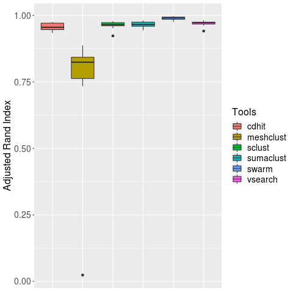
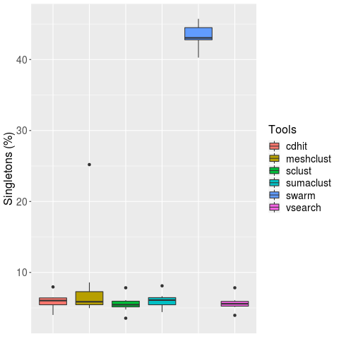

# Tools comparison 

Sclust is compared with 5 others clustering tools : CD-HIT, SWARM, VSEARCH, MESHCLUST and SUMACLUST. 

## Data used 

To compare tools, data for FROGS's evaluation are used (http://frogs.toulouse.inra.fr/). Synthethic data with powerlaw distribution and 1000 strains are used (http://frogs.toulouse.inra.fr/data_to_test_frogs/assessment_datasets/datasets_silva/1000sp/dataset_1/V4V4/powerlaw/). It's 16S sequencing sequencing simulation (V4 region). Different samples contains same strains but abundance levels varies (for example in sample 1 you will have strain1 in very high abundance and strain2 in low abundance and it will be the opposite in sample 2.). Dataset_1 is selected arbitrarily.

## Methods 
All launch commands are given in clusteringEval_EVAL/tools_comparison/commands.sh 

### Data preparation 
Sequencing simulation from FROGS contains chimeras reads, identified by the presence of two reference in fastq header. This chimera reads are removed with homemade script `exclude_chimeras.py`. 
Then, reads are deduplicated with `vsearch`.  
Taxonomy is treated with homemade script `frogs_taxo.py` which allows to better presentation of taxonomy present in fastq header.

### Clustering  
CD-HIT, Vsearch and MeshClust are launched with threshold id of 97%. Sclust is launched with id of 97, weak id of 95 and quality of 0, paramters determined as best previously. Swarm is launch with default parameters (d=1) as advised in its publication. Tools are launched for the 10 samples. 
Homemade script `clusteringEval_clustering.sh` launchs all clusterings with one fasta file in input. 
 
### Clustering evaluation 
Evaluation is made according to 4 criterias :  
* Precision : represents the ability of tool to reconstruct clusters with only 1 strain inside (avoid over-grouping) 
* Recall : represents the ability of tool to reconstruct clusters with all reads from 1 strain (avoid over-splitting) 
* ARI (Adjusted Rand Index) : summarize precision and recall, by taking acount the random chance to group 2 reads from same strains in same cluster. 
Swarm paper definition : *"adjusted Rand index, which summarizes both precision and recall as the proportion of pairs of amplicons that are placed in the same OTU and are from the same species, but adjusting for the expected proportions through random chance"* 
* Singletons percentage : represents the rate of singletons clusters among all clusters. 

Precision, recall and ARI definitions and computation are the same used in vsearch and swarm paper. 
Homemade script `clusteringEval_eval.sh` launchs all evaluation parameters calculation from previous clusterings.  

## Results 

All graphics and raw results are in clusteringEval_EVAL/tools_comparison. Graphics are obtained with R script `clusteringEval_graphs.R` (.pdf for graphics and .tsv for raw results). 
Evaluation is focused on ARI because it reflects recall and precision at same time. 

**ARI for clustering of 10 samples, with id 97 (d=1 for Swarm, weak id = 95 and quality = 0)**

**Singletons percentage for clustering of 10 samples, with id 97 (d=1 for Swarm, weak id = 95 and quality = 0)**

**Total_clusters, clusters size > 1 for all samples**   

| Tool | Mean total clusters | Sd total clusters | Mean clusters | Sd clusters | 
| ------ | -------------- | ----------------- | ------------ | ------------- | 
| CD-HIT | 725.9 | 4.53 | 682.8 | 6.05 |
| MESHCLUST | 508.5 | 97.75 | 472.3 | 105.37 |
| SCLUST | 736.7 | 3.59 | 695.9 | 6.64 |
| SUMACLUST | 749.9 | 9.57 | 704.8 | 9.89 |
| SWARM | 1294 | 27.87 | 731.6 | 7.83 |
| VSEARCH | 736.7 | 3.59 | 695 | 6.06 |

**Total clusters, clusters size > 1 for Sample01**  

|Tool|Total clusters|Clusters size > 1| 
|------|--------------|-----------------|
|CD-HIT|720|680|
|MESHCLUST|610|572|
|SCLUST|734|696|
|SUMACLUST|725|685|
|SWARM|1278|729|
|VSEARCH|734|694|

Other samples values can be found on nb_clusters.tsv 

* MeshClust has lower ARI than other tools (median 0.82). Swarm has the best ARI (median 0.99). Sclust has ARI slightly lower than Vsearch (median 0.96 for sclust and median 0.97 for vsearch). 
* But Sclust produces the least singletons clusters in proportion (median 5.6 %) and singletons is something we want to avoid. 
* MeshClust similarity calculation with learning doesn't work good in this dataset. When we used just alignment (option --align), evaluation parameters are better and similar to other tools, but this option requires a lot of calculation time.

 
